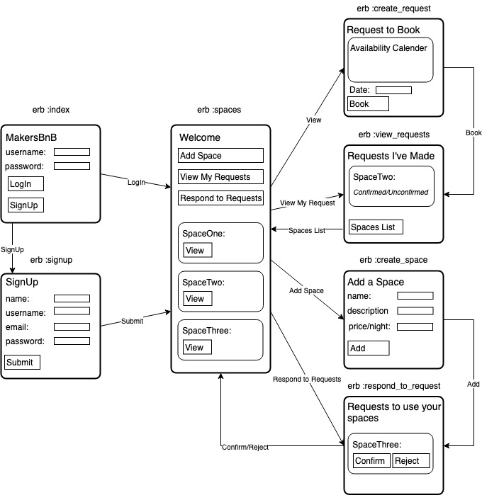
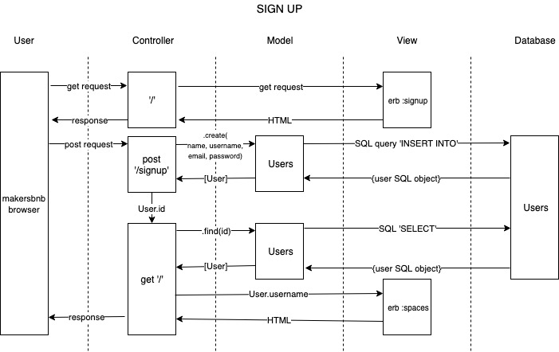

# APPROACH

*Created by: Chris Plant, Cosmin Croitoriu, Sam Kitchen, Nicholas Barnes, and Magnus Arbuthnott*

### SPECIFICATIONS

The following specifications were provided by Makers Academy:

- Any signed-up user can list a new space.
- Users can list multiple spaces.
- Users should be able to name their space, provide a short description of the space, and a price per night.
- Users should be able to offer a range of dates where their space is available.
- Any signed-up user can request to hire any space for one night, and this should be approved by the user that owns that space.
- Nights for which a space has already been booked should not be available for users to book that space.
- Until a user has confirmed a booking request, that space can still be booked for that night.

### DEVELOPMENT FRAMEWORKS

As this was our first group project we adopted a scaled down version of [Scrum (software development)](https://en.wikipedia.org/wiki/Scrum_(software_development)). We created a product backlog of features and worked through them in development teams. Each day we would incorporate a morning standup and an evening review.

### USER STORIES

From the specifications we drew the following user stories:

```
As a user(both),
So I can use Makers BnB,
I would like to sign up to Makers BnB with name, username, email, and password.

As a user(both),
So only I can use my account,
I would like to login to my Makers BnB account.

As a user(leaser),
So I can list a new space,
I would like to add a name, description, price, and availability dates.

As a user(renter),
so I can find a space to stay,
I would like to view available spaces.

As a user(renter),
So I can rent a space,
I would like to create a request to book on a listed space.

As a user(leaser),
So someone can rent my space,
I would like to confirm or deny a request to book.

As a user(both),
So many people can request to stay
My space will stay available until I've confirmed a booking

As a user(leaser),
So my space is not double booked,
My space will become unavailable when I have confirmed a booking.
```

And created this features flow chart to help our planning:



### MODELING

Ahead of starting the project we modeled our database:


And created domain models of each stage of our project based on our feature flowchart. The requirement of a domain model was based on the complexity of the feature. This one was is an example of our signup feature:



### Improvements / Enhancements

If we had more time we would:

* Add an availability calendar to spaces_new.erb

* Users should receive an email whenever one of the following happens:
  * They sign up
  * They create a space
  * They update a space
  * A user requests to book their space
  * They confirm a request
  * They request to book a space
  * Their request to book a space is confirmed
  * Their request to book a space is denied

* Users should receive a text message to a provided number whenever one of the following happens:
  * A user requests to book their space
  * Their request to book a space is confirmed
  * Their request to book a space is denied

* A ‘chat’ functionality once a space has been booked, allowing users whose space-booking request has been confirmed to chat with the user that owns that space.

* Basic payment implementation though Stripe.
